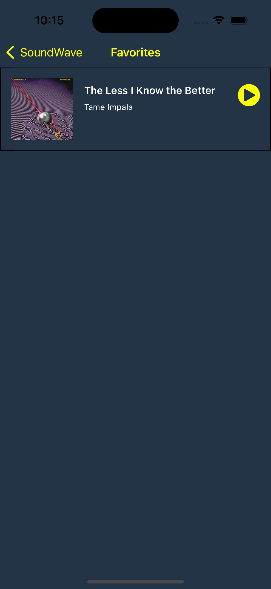

# SoundWave 🎵

Introducing SoundWave, the ultimate music companion that lets you discover,
listen, and curate your favorite songs like never before. With a sleek and 
intuitive interface, SoundWave revolutionizes the way you interact with your music library.

## Features

### 🔎 Discover and Explore
Unleash the power of SoundWave to explore an extensive collection of
songs from various genres, artists, and albums. With our intelligent search
feature, finding your favorite tracks is as easy as a few taps. Whether you're
in the mood for chart-toppers, classic hits, or hidden gems, SoundWave has you covered.

### 🎶 Listen in High Quality
Immerse yourself in a world of unparalleled sound quality. SoundWave ensures a seamless
audio experience with crystal-clear playback, delivering every beat and note with precision.
Feel the music like never before with our advanced audio technology that enhances your
listening pleasure.

### ❤️ Personalize Your Collection
Create your own musical universe by curating playlists tailored to your taste. Organize your
favorite tracks into playlists for every mood, occasion, or simply to express yourself. With
SoundWave, you have the power to customize your listening experience and make it truly your own.

### 🌟 User-Friendly Interface
SoundWave's sleek and intuitive interface provides a seamless user experience. Enjoy effortless
navigation and quick access to all the features that the app offers. Whether you're a music
aficionado or a casual listener, SoundWave's user-friendly design ensures that everyone can
enjoy the app to the fullest.

## Tech Stack 📲

- Swift
- UIKit
- Swift Package Manager
- Alamofire
- POP (Protocol Oriented Programming)
- VIPER Architecture
- App Modularization
- SOLID Principles
- Unit Test
- UI Test

## ScreenShots 📷

 
 
 

## VIPER

VIPER is an acronym for View, Interactor, Presenter, Entity, and Router. It is an architectural design pattern that promotes separation of concerns and modular development in iOS application development. Here's a brief explanation of each component in VIPER:

View: The View layer is responsible for presenting the user interface (UI) and handling user interactions. It receives input from the user and sends it to the Presenter for processing.

Interactor: The Interactor contains the business logic and serves as the bridge between the Presenter and the data layer. It performs tasks such as data fetching, processing, and manipulation. The Interactor receives requests from the Presenter and returns the results asynchronously.

Presenter: The Presenter acts as the intermediary between the View and the Interactor. It receives user input from the View, processes it by interacting with the Interactor, and prepares the data to be displayed by the View. The Presenter is also responsible for updating the UI based on the results received from the Interactor.

Entity: The Entity represents the application's data model or domain model. It encapsulates the data and defines the business logic related to that data. The Entity is independent of the VIPER architecture and can be reused across multiple modules.

Router: The Router handles the navigation and routing logic within the application. It is responsible for presenting or dismissing screens and coordinating the flow between different modules or components of the application.

The VIPER architecture promotes a modular and scalable approach to iOS development by clearly separating responsibilities and dependencies between components. It enhances testability, maintainability, and code reusability. Each component in VIPER has a specific role and follows a unidirectional flow of data, contributing to a more structured and organized codebase.

## Installation ⚙️

1. Clone the Project: git clone https://github.com/keremersu35/KeremErsu_HWFinal.git
2. Navigate to the project's root directory: cd KeremErsu_HWFinal
3. Open the project file in Xcode: open SoundWave.xcworkspace
4. Wait for the dependencies to be loaded.
5. Build and run the project in the iOS simulator or on a physical device by selecting a target and clicking the "Run" button in Xcode.

